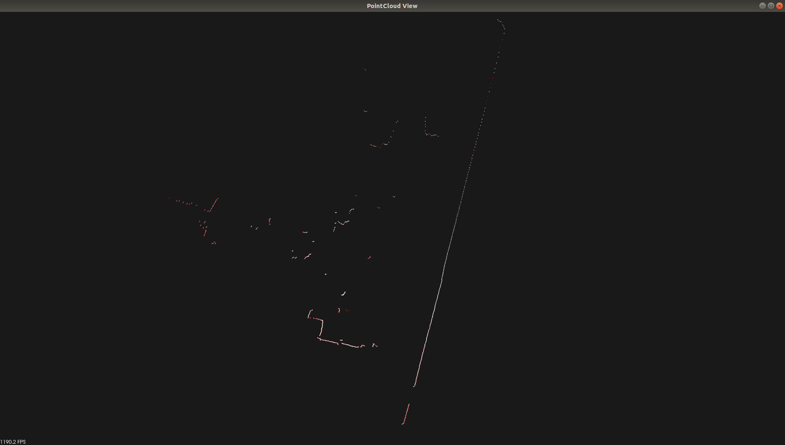
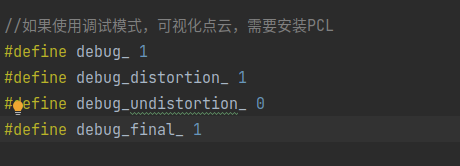

# lidar_undistortion_2d

> #### a ros package for 2d lidar motion compensation

## [原理简介](https://github.com/hanlin-cheng/slam-study-note/blob/master/slam_theory/2d%E6%BF%80%E5%85%89%E9%9B%B7%E8%BE%BE%E8%BF%90%E5%8A%A8%E8%A1%A5%E5%81%BF%E6%96%B9%E6%B3%95(%E5%8E%BB%E7%95%B8%E5%8F%98).md)

## Introduction

读取odom数据对2D激光雷达数据进行运动畸变校正。

This ros package uses odom transform data to correct motion distortion of a 2D LIDAR in real time。

## Result



在图片中，红色点云代表原始的激光雷达数据，白色点云代表经过运动补偿后的激光雷达数据。

in this picture, the red poindcloud represents the origin lidar data, and the white pointcloud represents the lidar data after compensation.

## Parameters in launch file

**你可以根据自己的项目更改相对应的value**

- ```launch
  <param name="use_sim_time" value="true"/>
  ```

  这个参数当回放bag数据集需要设置为true，此时说明系统使用的是仿真时间，如果设置为false，则系统使用walltime

- ```
  <node name="lidar_undistortion_2d_node" pkg="lidar_undistortion_2d" type="lidar_undistortion_2d_node">
        <param name="scan_sub_topic" value="/scan"/>
        <param name="scan_pub_topic" value="/scan_undistortion"/>
        <param name="enable_pub_pointcloud" value="true"/>
        <param name="pointcloud_pub_topic" value="/pointcloud_undistortion"/>
        <param name="lidar_frame" value="laser"/>
        <param name="odom_frame" value="odom_combined"/>
        <param name="lidar_scan_time_gain" value="1.0"/>
   </node>
  ```

  这个节点用于启动激光雷达运动畸变校正算法

名称 | 类型 |  注释
-------- | ----- | -----
scan_sub_topic | string | 订阅的2d激光数据话题名,你可以在终端输入`rostopic list`查看输入的激光雷达话题名，并且确认话题的数据类型应该为sensor_msgs::laserscan 
scan_pub_topic  | string | 经过运动畸变矫正后发布的2d激光数据话题名 
enable_pub_pointcloud  | bool | 是否将校正后的数据封装为3d pointcloud消息发布，如果不需要，则设置为false 
pointcloud_pub_topic | bool | 经过运动畸变矫正封装成pointcloud消息的话题名 
lidar_frame| string | 激光雷达数据的坐标系，你可以通过`rostopic echo <topic> --narro`查看输入激光雷达话题数据的frame_id,并且更改对应的value 
odom_frame | string | Odometry数据的坐标系，你需要查看/odom话题确定相应的frame_id并修改,操作同上 
lidar_scan_time_gain | double | 激光雷达单次扫描时间系数（正常情况下是1.0，但是有些激光雷达的驱动包在计算scan_time时有问题，所以这里乘一个系数）

## Test with rosbag

1. compile the project and `source devel/setup.sh`
2. execute the following command
```
roslaunch lidar_undistortion_2d lidar_undistortion_2d.launch
```
3. find `/bag/***.bag`
```
rosbag play --clock --pause ***.bag
```
remind: '--pause' is essential. otherwise it may lead to error. 

​	4.你可以选择打开pcl可视化或者自行进行rviz订阅节点消息



## Reference

https://github.com/LiuLimingCode/lidar_undistortion_2d

https://github.com/elewu/2d_lidar_undistortion

深蓝学院SLAM教程
